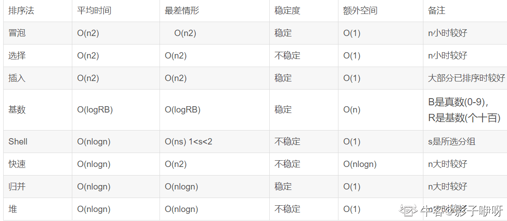

# 排序

[十大排序算法](https://www.cnblogs.com/onepixel/articles/7674659.html)

## 冒泡排序

1. 比较相邻的元素。如果第一个比第二个大，就交换它们两个；
2. 对每一对相邻元素作同样的工作，从开始第一对到结尾的最后一对，这样在最后的元素应该会是最大的数；
3. 针对所有的元素重复以上的步骤，除了最后一个；
4. 重复步骤 1~3，直到排序完成。

```js
function bubbleSort(arr) {
  let len = arr.length;
  for (let i = 0; i < len - 1; i++) {
    for (let j = 0; j < len - i - 1; j++) {
      if (arr[j] > arr[j + 1]) {
        let temp = arr[j];
        arr[j] = arr[j + 1];
        arr[j + 1] = temp;
      }
    }
  }
  return arr;
}
```

## 选择排序

表现最稳定的排序算法之一，因为无论什么数据进去都是O(n2)的时间复杂度，所以用到它的时候，数据规模越小越好。

1. 首先在未排序序列中找到最小（大）元素，存放到排序序列的起始位置。
2. 再从剩余未排序元素中继续寻找最小（大）元素，然后放到已排序序列的末尾。
3. 重复第二步，直到所有元素均排序完毕。

```js
function selectionSort(arr) {
  let len = arr.length;
  let minIndex;
  for (let i = 0; i < len; i++) {
    minIndex = i;
    for (let j = i + 1; j < len; j++) {
      if (arr[j] < arr[minIndex]) {
        minIndex = j;
      }
    }
    let temp = arr[i];
    arr[i] = arr[minIndex];
    arr[minIndex] = temp;
  }
  return arr;
}
```

## 插入排序  

插入排序（Insertion-Sort）的算法描述是一种简单直观的排序算法。它的工作原理是通过构建有序序列，对于未排序数据，在已排序序列中从后向前扫描，找到相应位置并插入  

1. 从第一个元素开始，该元素可以认为已经被排序；
2. 取出下一个元素，在已经排序的元素序列中从后向前扫描；
3. 如果该元素（已排序）大于新元素，将该元素移到下一位置；
4. 重复步骤3，直到找到已排序的元素小于或者等于新元素的位置；
5. 将新元素插入到该位置后；
6. 重复步骤2~5。

```js
function insertionSort(arr) {
  let len = arr.length;
  let preIndex;
  let current;
  for (let i = 0; i < len; i++) {
    preIndex = i - 1;
    current = arr[i];
    while(preIndex >= 0 && arr[preIndex] > current) {
       arr[preIndex + 1] = arr[preIndex];
       preIndex--;
    }
    arr[preIndex + 1] = current
  }
  return arr;
}
```

## 归并排序  

归并排序是一种稳定的排序方法。和选择排序一样，归并排序的性能不受输入数据的影响，但表现比选择排序好的多，因为始终都是O(nlogn）的时间复杂度。代价是需要额外的内存空间。

1. 把长度为n的输入序列分成两个长度为n/2的子序列；
2. 对这两个子序列分别采用归并排序；
3. 将两个排序好的子序列合并成一个最终的排序序列。

```js
function mergeSort(arr) {
  let len = arr.length;
  if (len < 2) {
    return arr;
  }
  let middle = Math.floor(len/2);
  let left = arr.slice(0, middle);
  let right = arr.slice(middle);

  return merge(mergeSort(left), mergeSort(right))
}

function merge(left, right) {
  let result = [];
  
  while(left.length > 0 && right.length > 0) {
    if (left[0] >= right[0]) {
      result.push(right.shift())
    } else {
      result.push(left.shift())
    }
  }
  while(left.length) {
    result.push(left.shift())
  }
  while(right.length) {
    result.push(right.shift())
  }
  return result;
}
```
## 快速排序

快速排序的基本思想：通过一趟排序将待排记录分隔成独立的两部分，其中一部分记录的关键字均比另一部分的关键字小，则可分别对这两部分记录继续进行排序，以达到整个序列有序。  

快速排序使用分治法来把一个串（list）分为两个子串（sub-lists）。具体算法描述如下：

1. 从数列中挑出一个元素，称为 “基准”（pivot）；
2. 重新排序数列，所有元素比基准值小的摆放在基准前面，所有元素比基准值大的摆在基准的后面（相同的数可以到任一边）。在这个分区退出之后，该基准就处于数列的中间位置。这个称为分区（partition）操作；
3. 递归地（recursive）把小于基准值元素的子数列和大于基准值元素的子数列排序。

```js
function quickSort(arr) {
  if (arr.length < 2) {
    return arr;
  } else {
    let left = [];
    let right = [];
    let pivot = arr[0];
    let pivotArr = [];
    for (let i = 0; i < arr.length; i++) {
      if (arr[i] === pivot) {
        pivotArr.push(arr[i])
    } else if (arr[i] > pivot) {
        right.push(arr[i]);
    } else {
      left.push(arr[i])
    }
  }
   return quickSort(left).concat(pivotArr).concat(quickSort(right))
 }
}
```



